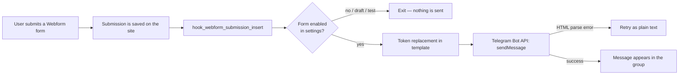

# Webform Telegram Notifier

[](https://www.drupal.org)
[](https://www.drupal.org/project/webform)
[](LICENSE)
[](../../releases)

English | **[Русский](README.md)**

---

A module for Drupal 10/11 that **automatically sends new Webform submissions
to Telegram** — into a group or channel where your bot is a member.

Every form submission appears in your team's Telegram group instantly:
no need to check email or the admin panel — orders, callbacks and contact
requests become visible right after the form is submitted.

## Features

- **Admin settings page** — Configuration → System → "Telegram submission
  notifications" (`/admin/config/system/telegram-notify`):
  - bot token (stored value is hidden; leave the field empty to keep it);
  - chat or group ID;
  - message format: HTML or plain text;
  - list of all Webform forms with checkboxes — pick which forms to deliver;
  - message template with a clickable token browser;
  - **"Send test message"** button for instant bot/chat validation.
- **Webform + Token support**: any submission field value, submission ID,
  form title, site name, date, user — all replaceable in the template.
- **HTML format**: bold field names, links; if the markup is invalid the
  module automatically retries with plain text — the message is always
  delivered.
- **Reliability**: a Telegram failure never interrupts submission saving;
  errors are logged to Drupal watchdog (dblog).
- **Telegram 4096-character limit** is handled automatically.
- Webform drafts and test submissions are not sent to Telegram.

## Requirements

| Component | Version |
|---|---|
| Drupal | ^10 \|\| ^11 |
| PHP | >= 8.1 |
| [Webform](https://www.drupal.org/project/webform) | ^6.0 |
| [Token](https://www.drupal.org/project/token) | ^1.0 |

## Installation

### Via Composer (recommended)

```bash
# 1. Register the repository in your project's composer.json
composer config repositories.webform-telegram-notifier vcs https://github.com/Mmitekk/drupal-commerce-to-telegram

# 2. Install the module (it lands in web/modules/custom/)
composer require drupal/webform_telegram_notifier:^1.0

# 3. Enable the module
drush en webform_telegram_notifier -y
```

No access tokens or Packagist registration are required — the repository
is public, Composer pulls the package straight from GitHub.

### Manually

1. Download the archive: **Code → Download ZIP** (or from the
   [Releases](../../releases) page).
2. Unpack it into `web/modules/custom/` and **rename the folder** to
   `webform_telegram_notifier` (important — the machine name must match
   the directory name).
3. Clear caches (`drush cr` or `/admin/config/development/performance`).
4. Enable the module: **Manage → Extend** (`/admin/modules`).

### Via Drush (after manual installation)

```bash
drush en webform_telegram_notifier -y
```

## Configuration

### 1. Create a bot

1. Find **@BotFather** in Telegram → send `/newbot`.
2. Set the bot name and receive a token like
   `123456789:AAE1b2c3D4e5F6g7H8i9J0k1L2m3N4o5p6q`.

### 2. Add the bot to a group and get the chat_id

1. Add the bot to the group (for **channels** — as an administrator with
   posting rights).
2. Get the group ID in any of these ways:
   - add **@getidsbot** to the group — it will show the `chat id`;
   - forward any message from the group to **@getmyid_bot**;
   - post anything to the group and open
     `https://api.telegram.org/bot<TOKEN>/getUpdates` — look for
     `"chat":{"id":-100…`.
3. Supergroups and channels have a negative ID like `-1001234567890`.

### 3. Configure the module

Open **Configuration → System → Telegram submission notifications**:

1. Paste the **bot token**.
2. Enter the **chat/group ID**.
3. Choose the **format** (HTML by default).
4. Check the **forms** to deliver.
5. Adjust the **message template** if needed.
6. Click **"Send test message"** — a test will arrive in the group if
   everything is configured correctly.
7. Save the settings.

## How it works



1. A user submits a Webform form — the submission is saved as usual.
2. On the submission insert event (`hook_webform_submission_insert`) the
   module checks whether the form is enabled in the settings. Drafts and
   test submissions are skipped.
3. Template tokens are replaced with the submission data (Token service +
   Webform tokens).
4. The message is sent via the Telegram Bot API
   (`https://api.telegram.org/bot…/sendMessage`) to the configured chat.
5. If Telegram rejects the HTML markup, the message is resent as plain
   text. The 4096-character limit is respected.
6. Any network or API error **never interrupts the submission save** — it
   is logged under **Reports → Recent log messages**
   (`/admin/reports/dblog`), channel `webform_telegram_notifier`.

All communication happens synchronously with 10 s (request) and 5 s
(connection) timeouts, so the form page never hangs for long even if
Telegram is unreachable.

## Template tokens

| Token | Substitutes |
|---|---|
| `[webform_submission:values]` | All submitted fields ("Label: value") |
| `[webform_submission:values:phone]` | Value of a specific field (element machine name) |
| `[webform_submission:sid]` | Submission ID |
| `[webform_submission:webform:title]` | Form title |
| `[webform_submission:created]` | Submission creation date |
| `[webform_submission:url]` | Link to the submission page |
| `[site:name]` | Site name |
| `[current-date:medium]` | Current date/time |
| `[current-user:name]` | User who submitted the form |

Element machine names are shown on the **"Elements"** tab of the form
(Structure → Webforms → your form → Elements → Edit → Machine name).
The full token list is available via the "Browse available tokens" link
below the template field.

### HTML tags allowed by Telegram

`<b>`, `<i>`, `<u>`, `<s>`, `<a href="…">`, `<code>`, `<pre>`,
`<blockquote>`. Line break is a plain Enter. `<br>` tags produced by token
substitution are automatically converted to line breaks.

## Troubleshooting

| Telegram error | Cause and fix |
|---|---|
| `Unauthorized` | Wrong bot token — verify it with @BotFather |
| `Bad Request: chat not found` | Wrong chat ID or the bot is not a group member |
| `Forbidden: bot was kicked…` | The bot was removed from the group — add it again |
| `Bad Request: can't parse entities` | Invalid HTML markup (the module retries as plain text) |
| `Too Many Requests` | Telegram rate limit hit — retry shortly |

All errors are also recorded in the Drupal log with the submission ID.

## Security

- Settings access requires the `administer webform telegram notifier`
  permission (administrators only by default).
- The bot token is stored in the site configuration and is **never
  displayed** on the settings page: leave the field empty to keep the
  current token.
- On configuration export (`drush cex`) the token ends up in the exported
  files — never publish or commit them to public repositories.

## Module structure

```
webform_telegram_notifier/
├── composer.json                               — Composer package (drupal-custom-module)
├── webform_telegram_notifier.info.yml          — module definition and dependencies
├── webform_telegram_notifier.module            — Webform integration hook
├── webform_telegram_notifier.services.yml      — sender service
├── webform_telegram_notifier.routing.yml       — settings page route
├── webform_telegram_notifier.links.menu.yml    — configuration menu item
├── webform_telegram_notifier.permissions.yml   — permission
├── config/install/webform_telegram_notifier.settings.yml — default settings
├── config/schema/webform_telegram_notifier.schema.yml    — config schema
├── src/Service/TelegramSender.php              — Telegram Bot API sender
└── src/Form/SettingsForm.php                   — settings page
```

## License

[GPL-2.0-or-later](LICENSE) — same as Drupal core itself.
