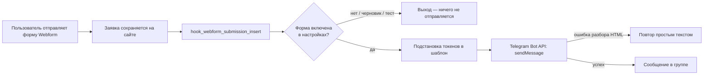

# Webform Telegram Notifier

[](https://www.drupal.org)
[](https://www.drupal.org/project/webform)
[](LICENSE)
[](../../releases)

**[English](README.en.md)** | Русский

---

Модуль для Drupal 10/11, который **автоматически отправляет новые заявки
Webform в Telegram** — в группу или канал, в которой(ом) присутствует ваш бот.

Каждая оформленная заявка с сайта мгновенно попадает в телеграм-группу
менеджеров: не нужно проверять почту или админку — новые заказы, звонки и
обратные связи видны сразу после отправки формы.

## Возможности

- **Страница настроек в админке** — Конфигурация → Система →
  «Telegram-уведомления о заявках» (`/admin/config/system/telegram-notify`):
  - токен бота (сохранённое значение скрыто, пустое поле = не менять);
  - ID чата или группы;
  - формат сообщения: HTML или простой текст;
  - список всех форм Webform с чекбоксами — какие формы доставлять;
  - шаблон сообщения с кликабельным списком токенов;
  - кнопка **«Отправить тестовое сообщение»** для мгновенной проверки бота и чата.
- **Токены Webform + Token**: значения любых полей заявки, номер, название
  формы, сайт, дата, пользователь — всё подставляется в шаблон.
- **Формат HTML**: жирные названия полей, ссылки; при некорректной разметке
  модуль автоматически повторяет отправку простым текстом — заявка дойдёт
  в любом случае.
- **Надёжность**: сбой Telegram никогда не прерывает сохранение заявки;
  ошибки пишутся в журнал Drupal (dblog).
- **Лимит Telegram 4096 символов** соблюдается автоматически.
- Черновики и тестовые отправки Webform в Telegram не дублируются.

## Требования

| Компонент | Версия |
|---|---|
| Drupal | ^10 \|\| ^11 |
| PHP | >= 8.1 |
| [Webform](https://www.drupal.org/project/webform) | ^6.0 |
| [Token](https://www.drupal.org/project/token) | ^1.0 |

## Установка

### Через Composer (рекомендуется)

```bash
# 1. Подключить репозиторий в composer.json проекта
composer config repositories.webform-telegram-notifier vcs https://github.com/Mmitekk/drupal-commerce-to-telegram

# 2. Установить модуль (станет доступен в web/modules/custom/)
composer require drupal/webform_telegram_notifier:^1.0

# 3. Включить модуль
drush en webform_telegram_notifier -y
```

Никаких токенов доступа и регистрации на Packagist не требуется —
репозиторий публичный, Composer забирает пакет напрямую с GitHub.

### Вручную

1. Скачайте архив: **Code → Download ZIP** (или со страницы
   [Releases](../../releases)).
2. Распакуйте в `web/modules/custom/` и **переименуйте папку** в
   `webform_telegram_notifier` (важно — машинное имя модуля должно совпадать
   с именем каталога).
3. Очистите кеш (`drush cr` или `/admin/config/development/performance`).
4. Включите модуль: **Управление → Расширение** (`/admin/modules`).

### Через Drush (после ручной установки)

```bash
drush en webform_telegram_notifier -y
```

## Настройка

### 1. Создание бота

1. В Telegram найдите **@BotFather** → команда `/newbot`.
2. Задайте имя бота и получите токен вида
   `123456789:AAE1b2c3D4e5F6g7H8i9J0k1L2m3N4o5p6q`.

### 2. Добавление бота в группу и получение chat_id

1. Добавьте бота в группу (для **канала** — как администратора с правом
   публикации).
2. Узнайте ID группы любым способом:
   - добавьте в группу бота **@getidsbot** — он покажет `chat id`;
   - перешлите любое сообщение из группы боту **@getmyid_bot**;
   - напишите что-нибудь в группу и откройте
     `https://api.telegram.org/bot<ТОКЕН>/getUpdates` — найдите
     `"chat":{"id":-100…`.
3. Супергруппы и каналы имеют отрицательный ID вида `-1001234567890`.

### 3. Настройка модуля

Откройте **Конфигурация → Система → Telegram-уведомления о заявках**:

1. Вставьте **токен бота**.
2. Укажите **ID чата/группы**.
3. Выберите **формат** (HTML по умолчанию).
4. Отметьте **формы** для отправки.
5. При необходимости измените **шаблон сообщения**.
6. Нажмите **«Отправить тестовое сообщение»** — тест придёт в группу, если
   всё настроено верно.
7. Сохраните настройки.

## Как это работает



1. Пользователь отправляет форму Webform — заявка сохраняется штатно.
2. На событии создания заявки (`hook_webform_submission_insert`) модуль
   проверяет, включена ли форма в настройках. Черновики и тестовые
   отправки пропускаются.
3. Токены шаблона заменяются данными заявки (сервис Token + токены Webform).
4. Сообщение отправляется через Telegram Bot API
   (`https://api.telegram.org/bot…/sendMessage`) в настроенный чат.
5. Если Telegram отклонил HTML-разметку — отправка повторяется простым
   текстом. Лимит 4096 символов соблюдается.
6. Любая ошибка сети или API **не прерывает сохранение заявки** — она
   записывается в журнал: **Отчёты → Последние сообщения журнала**
   (`/admin/reports/dblog`), канал `webform_telegram_notifier`.

Весь обмен происходит синхронно с таймаутами 10 с (запрос) и 5 с
(подключение), поэтому страница формы не «зависает» надолго даже при
недоступном Telegram.

## Токены шаблона

| Токен | Что подставляет |
|---|---|
| `[webform_submission:values]` | Все заполненные поля заявки («Название: значение») |
| `[webform_submission:values:telefon]` | Значение конкретного поля (машинное имя элемента) |
| `[webform_submission:sid]` | Номер заявки |
| `[webform_submission:webform:title]` | Название формы |
| `[webform_submission:created]` | Дата создания заявки |
| `[webform_submission:url]` | Ссылка на просмотр заявки |
| `[site:name]` | Название сайта |
| `[current-date:medium]` | Текущая дата/время |
| `[current-user:name]` | Пользователь, отправивший заявку |

Машинное имя элемента смотрите на вкладке **«Элементы»** формы
(«Структура → Формы Webform → ваша форма → Элементы → Редактировать →
Машинное имя»). Полный список токенов — по ссылке «Просмотр доступных
токенов» под полем шаблона.

### Разрешённые HTML-теги Telegram

`<b>`, `<i>`, `<u>`, `<s>`, `<a href="…">`, `<code>`, `<pre>`,
`<blockquote>`. Перенос строки — обычный Enter. Тег `<br>` при подстановке
токенов автоматически заменяется на перевод строки.

## Диагностика ошибок

| Ошибка Telegram | Причина и решение |
|---|---|
| `Unauthorized` | Неверный токен бота — проверьте значение у @BotFather |
| `Bad Request: chat not found` | Неверный ID чата или бот не добавлен в группу |
| `Forbidden: bot was kicked…` | Бота удалили из группы — добавьте снова |
| `Bad Request: can't parse entities` | Ошибка HTML-разметки (модуль сам повторит простым текстом) |
| `Too Many Requests` | Превышен лимит Telegram — кратковременно повторите позже |

Все ошибки также фиксируются в журнале Drupal с указанием номера заявки.

## Безопасность

- Доступ к настройкам — только с правом `administer webform telegram
  notifier` (по умолчанию только администраторы).
- Токен бота хранится в конфигурации сайта и **не выводится** на странице
  настроек: чтобы оставить прежний токен, оставьте поле пустым.
- При выгрузке конфигурации (`drush cex`) токен попадает в файлы экспорта —
  не публикуйте их и не коммитьте в публичные репозитории.

## Структура модуля

```
webform_telegram_notifier/
├── composer.json                               — пакет Composer (drupal-custom-module)
├── webform_telegram_notifier.info.yml          — описание и зависимости
├── webform_telegram_notifier.module            — хук интеграции с Webform
├── webform_telegram_notifier.services.yml      — сервис отправки
├── webform_telegram_notifier.routing.yml       — маршрут страницы настроек
├── webform_telegram_notifier.links.menu.yml    — пункт в меню конфигурации
├── webform_telegram_notifier.permissions.yml   — право доступа
├── config/install/webform_telegram_notifier.settings.yml — настройки по умолчанию
├── config/schema/webform_telegram_notifier.schema.yml    — схема конфигурации
├── src/Service/TelegramSender.php              — отправка в Telegram Bot API
└── src/Form/SettingsForm.php                   — страница настроек
```

## Лицензия

[GPL-2.0-or-later](LICENSE) — как и само ядро Drupal.
