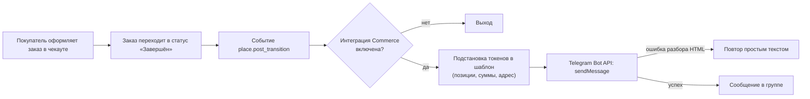

# Commerce to Telegram

[](https://www.drupal.org)
[](https://www.drupal.org/project/commerce)
[](LICENSE)
[](../../releases)

**[English](README.en.md)** | Русский

---

Модуль для Drupal 10/11, который **автоматически отправляет в Telegram новые
заказы Drupal Commerce** — в группу или канал, в которой(ом) присутствует ваш
бот. Дополнительно (опционально) умеет отправлять заявки из форм Webform.

Каждый оформленный заказ мгновенно появляется в телеграм-группе менеджеров:
номер заказа, состав (позиции и суммы), покупатель, адрес и итог. Не нужно
проверять почту и админку — заказы видны сразу после оформления.

## Возможности

- **Drupal Commerce (основная интеграция)**: уведомление отправляется в
  момент размещения заказа — переход в статус «Завершён» при оформлении
  (событие `commerce_order.place.post_transition` — то же, на котором сам
  Commerce отправляет письмо-квитанцию).
- **Webform (опционально)**: если установлен модуль Webform, можно включить
  доставку заявок выбранных форм — всё в тот же чат.
- **Страница настроек в админке** — Конфигурация → Система →
  «Telegram-уведомления: заказы и заявки»
  (`/admin/config/system/commerce-to-telegram`):
  - токен бота (сохранённое значение скрыто, пустое поле = не менять);
  - ID чата или группы;
  - формат сообщения: HTML или простой текст;
  - адрес Telegram API и прокси — если хостинг ограничивает доступ к Telegram
    (ошибка «cURL error 28»);
  - прямое соединение по IP — если DNS хостинга не резолвит api.telegram.org;
  - шаблон сообщения о заказе и шаблон о заявке;
  - чекбоксы форм Webform для доставки;
  - кнопка **«Сохранить и отправить тестовое сообщение»** — сохраняет
    настройки и мгновенно проверяет доставку.
- **Токены**: стандартные токены Commerce и Webform через модуль Token
  **плюс дополнительные токены модуля**:
  - `[commerce_order:items_table]` — все позиции заказа, по одной в строке
    («2 × Товар — 2 400 руб.»);
  - `[commerce_order:billing_address]` — платёжный адрес;
  - `[commerce_order:shipping_address]` — адрес доставки (нужен Commerce Shipping).
- **Формат HTML**: жирные заголовки, аккуратные переносы; при некорректной
  разметке модуль автоматически повторяет отправку простым текстом —
  уведомление дойдёт в любом случае.
- **Надёжность**: сбой Telegram никогда не прерывает оформление заказа и
  сохранение заявки; ошибки пишутся в журнал Drupal (dblog,
  канал `commerce_to_telegram`).
- **Лимит Telegram 4096 символов** соблюдается автоматически.

## Требования

| Компонент | Версия | Обязательность |
|---|---|---|
| Drupal | ^10 \|\| ^11 | да |
| PHP | >= 8.1 | да |
| [Drupal Commerce](https://www.drupal.org/project/commerce) | ^2.0 | да (устанавливается Composer'ом) |
| [Token](https://www.drupal.org/project/token) | ^1.0 | да (устанавливается Composer'ом) |
| [Webform](https://www.drupal.org/project/webform) | ^6.0 | опционально |

Интеграции включаются автоматически по факту наличия модулей: если Commerce
не установлен, раздел «Заказы» в админке скрыт; если не установлен Webform —
скрыт раздел форм.

## Установка

### Через Composer (рекомендуется)

```bash
# 1. Подключить репозиторий в composer.json проекта
composer config repositories.commerce-to-telegram vcs https://github.com/Mmitekk/drupal-commerce-to-telegram

# 2. Установить модуль последней версии (станет доступен в web/modules/custom/)
composer require drupal/commerce_to_telegram

# 3. Включить модуль
drush en commerce_to_telegram -y
```

Без указания версии Composer поставит **последний стабильный релиз**.
Никаких токенов доступа и регистрации на Packagist не требуется —
репозиторий публичный, Composer забирает пакет напрямую с GitHub.

> Чтобы команда `composer require drupal/commerce_to_telegram` работала
> совсем «классически» (без подключения репозитория), можно один раз
> зарегистрировать пакет на [packagist.org](https://packagist.org):
> Submit → вставить URL этого репозитория. После этого репозиторий в
> composer.json подключать уже не нужно.

### Вручную

1. Скачайте архив: **Code → Download ZIP** или файл
   `commerce_to_telegram-1.0.3.zip` со страницы
   [Releases](../../releases).
2. Распакуйте в `web/modules/custom/` так, чтобы получился путь
   `web/modules/custom/commerce_to_telegram/commerce_to_telegram.info.yml`.
3. Очистите кеш (`drush cr` или `/admin/config/development/performance`).
4. Включите модуль: **Управление → Расширение** (`/admin/modules`).

## Настройка

### 1. Создание бота

1. В Telegram найдите **@BotFather** → команда `/newbot`.
2. Задайте имя бота и получите токен вида
   `123456789:AAE1b2c3D4e5F6g7H8i9J0k1L2m3N4o5p6q`.

### 2. Добавление бота в группу и получение chat_id

1. Добавьте бота в группу (для **канала** — как администратора с правом
   публикации).
2. Узнайте ID группы любым способом:
   - добавьте в группу бота **@getidsbot** — он покажет `chat id`;
   - перешлите любое сообщение из группы боту **@getmyid_bot**;
   - напишите что-нибудь в группу и откройте
     `https://api.telegram.org/bot<ТОКЕН>/getUpdates` — найдите
     `"chat":{"id":-100…`.
3. Супергруппы и каналы имеют отрицательный ID вида `-1001234567890`.

### 3. Настройка модуля

Откройте **Конфигурация → Система → Telegram-уведомления: заказы и заявки**:

1. Вставьте **токен бота**.
2. Укажите **ID чата/группы**.
3. Выберите **формат** (HTML по умолчанию).
4. В разделе **«Заказы Drupal Commerce»** включите отправку и при
   необходимости измените шаблон.
5. Нажмите **«Сохранить и отправить тестовое сообщение»** — настройки
   сохранятся, тест придёт в группу, если всё настроено верно (ошибка
   Telegram будет показана на странице).

## Как это работает



1. Покупатель завершает чекаут — заказ переходит в статус «Завершён».
2. Модуль перехватывает событие размещения заказа
   (`commerce_order.place.post_transition`).
3. Токены шаблона заменяются данными заказа; список позиций и адреса
   формируются встроенными токенами модуля.
4. Сообщение отправляется через Telegram Bot API
   (`https://api.telegram.org/bot…/sendMessage`) в настроенный чат.
5. Если Telegram отклонил HTML-разметку — отправка повторяется простым
   текстом. Лимит 4096 символов соблюдается.
6. Любая ошибка сети или API **не прерывает оформление заказа** — она
   записывается в журнал: **Отчёты → Последние сообщения журнала**
   (`/admin/reports/dblog`), канал `commerce_to_telegram`.

Весь обмен происходит синхронно с таймаутами 10 с (запрос) и 5 с
(подключение). Заявки Webform обрабатываются аналогично — на событии
создания заявки (`hook_webform_submission_insert`); черновики и тестовые
отправки не дублируются.

## Токены шаблона заказа

| Токен | Что подставляет |
|---|---|
| `[commerce_order:order_number]` | Номер заказа |
| `[commerce_order:items_table]` | Все позиции: «кол-во × название — сумма» |
| `[commerce_order:total_price]` | Итоговая сумма с валютой |
| `[commerce_order:mail]` | E-mail покупателя из заказа |
| `[commerce_order:state]` | Статус заказа |
| `[commerce_order:billing_address]` | Платёжный адрес |
| `[commerce_order:shipping_address]` | Адрес доставки (Commerce Shipping) |
| `[site:name]` | Название сайта |
| `[current-date:medium]` | Дата/время |

Также доступны стандартные токены Commerce (`[commerce_order:…]`,
`[commerce_store:…]`) и глобальные токены Token-модуля — полный список
открывается по ссылке «Просмотр доступных токенов» под полем шаблона.

### Токены шаблона заявки (Webform)

| Токен | Что подставляет |
|---|---|
| `[webform_submission:values]` | Все заполненные поля заявки |
| `[webform_submission:values:telefon]` | Значение конкретного поля (машинное имя элемента) |
| `[webform_submission:sid]` | Номер заявки |
| `[webform_submission:webform:title]` | Название формы |

### Разрешённые HTML-теги Telegram

`<b>`, `<i>`, `<u>`, `<s>`, `<a href="…">`, `<code>`, `<pre>`,
`<blockquote>`. Перенос строки — обычный Enter. Тег `<br>` при подстановке
токенов автоматически заменяется на перевод строки.

## Диагностика ошибок

| Ошибка Telegram | Причина и решение |
|---|---|
| `Unauthorized` | Неверный токен бота — проверьте значение у @BotFather |
| `Bad Request: chat not found` | Неверный ID чата или бот не добавлен в группу |
| `Forbidden: bot was kicked…` | Бота удалили из группы — добавьте снова |
| `Bad Request: can't parse entities` | Ошибка HTML-разметки (модуль сам повторит простым текстом) |
| `Too Many Requests` | Превышен лимит Telegram — кратковременно повторите позже |
| `cURL error 28: Connection timed out` | Сервер хостинга не может соединиться с api.telegram.org — см. раздел ниже |

Все ошибки также фиксируются в журнале Drupal с указанием номера заказа
или заявки.

### Если при оформлении заказа появляется ошибка «Не удаётся отправить e-mail»

Это не модуль Telegram: письмо-квитанцию покупателю пытается отправить сам
Commerce, а SMTP вашего хостинга/Яндекса отключён или не оплачен. Варианты:

1. **Наладить почту** (рекомендуется): включить платный SMTP в Яндекс 360
   или подключить любой SMTP-провайдер через модуль
   [PHPMailer SMTP](https://www.drupal.org/project/phpmailer_smtp).
2. **Отключить письма-квитанции о заказе** штатной настройкой Commerce:
   **Торговля → Конфигурация → Типы заказов → Изменить**
   (`/admin/commerce/config/order-types/*/edit`) → снять галочку
   **«Email the customer a receipt when an order is placed»** → Сохранить.
   Письма о заказах перестанут отправляться (и ошибок больше не будет),
   Telegram-уведомления продолжат приходить.

### Если хостинг не открывает api.telegram.org (cURL error 28)

Ошибка вида `cURL error 28: Failed to connect to api.telegram.org port 443:
Connection timed out` означает, что сервер хостинга вообще не может
установить соединение с Telegram. От токена и настроек модуля это не
зависит — проблема на уровне сети хостинга. Порядок действий:

1. **Обновитесь до v1.0.3** и повторите тест: модуль принудительно
   соединяется по IPv4, что чинит серверы с неработающим IPv6 (частая
   причина именно таких таймаутов).
2. **Попробуйте прямое соединение по IP** — настройка
   «Прямое соединение по IP»: укажите `149.154.167.220` (актуальный IP
   api.telegram.org). Модуль будет ходить на этот IP напрямую, сохраняя
   имя api.telegram.org в HTTPS — эквивалент
   `curl --resolve api.telegram.org:443:149.154.167.220`. Помогает, когда
   DNS хостинга не резолвит или подменяет имя Telegram, но сам IP
   доступен. Диагностика по SSH:

   ```bash
   # обычный запрос — может падать по таймауту
   curl -sS --max-time 10 https://api.telegram.org/

   # тот же запрос напрямую через IP Telegram
   curl -sS --max-time 10 --resolve api.telegram.org:443:149.154.167.220 https://api.telegram.org/
   ```

   Если второй вариант отвечает, а первый — нет, проблема в DNS, и
   привязка к IP её решит. Актуальный IP можно узнать командой
   `nslookup api.telegram.org 8.8.8.8` с любой машины со здоровым DNS;
   если Telegram сменит IP — просто обновите значение в настройках.
3. **Обратитесь в поддержку хостинга** (готовый шаблон): «С сервера
   хостинга недоступен api.telegram.org (TCP 443, подсеть
   149.154.160.0/20). При исходящем соединении из PHP/cURL получаю
   "Connection timed out". Прошу проверить и открыть исходящие
   соединения к api.telegram.org».
4. **Укажите прокси** в настройках модуля — поле «Прокси для доступа
   к Telegram»: `http://хост:порт`, `https://хост:порт` или
   `socks5://логин:пароль@хост:порт`.
5. **Свой бесплатный релей через Cloudflare Workers** (5 минут, тариф
   Free подходит): cloudflare.com → Workers & Pages → Create Worker →
   вставьте код:

   ```js
   export default {
     async fetch(request) {
       const url = new URL(request.url);
       url.hostname = 'api.telegram.org';
       return fetch(new Request(url, request));
     },
   };
   ```

   После Deploy скопируйте адрес воркера вида
   `https://имя-воркера.аккаунт.workers.dev` и вставьте его в поле
   **«Адрес Telegram API»** в настройках модуля — запросы пойдут через
   Cloudflare на api.telegram.org, сквозь релей проходит и TLS, и токен
   в составе пути (перехватить его по пути нельзя).

## Безопасность

- Доступ к настройкам — только с правом `administer commerce to telegram`
  (по умолчанию только администраторы).
- Токен бота хранится в конфигурации сайта и **не выводится** на странице
  настроек: чтобы оставить прежний токен, оставьте поле пустым.
- При выгрузке конфигурации (`drush cex`) токен попадает в файлы экспорта —
  не публикуйте и не коммитьте их в публичные репозитории.

## Структура модуля

```
commerce_to_telegram/
├── composer.json                            — пакет Composer (drupal-custom-module)
├── commerce_to_telegram.info.yml            — описание модуля
├── commerce_to_telegram.module              — Webform-хук + токены заказа
├── commerce_to_telegram.services.yml        — сервисы (отправка, подписчик событий)
├── commerce_to_telegram.routing.yml         — маршрут страницы настроек
├── commerce_to_telegram.links.menu.yml      — пункт в меню конфигурации
├── commerce_to_telegram.permissions.yml     — право доступа
├── config/install/commerce_to_telegram.settings.yml — настройки по умолчанию
├── config/schema/commerce_to_telegram.schema.yml    — схема конфигурации
├── src/Service/TelegramSender.php           — отправка в Telegram Bot API
├── src/EventSubscriber/OrderEventSubscriber.php — событие размещения заказа
└── src/Form/SettingsForm.php                — страница настроек
```

## История версий

### v1.0.3
- **Прямое соединение по IP**: новая настройка — эквивалент
  `curl --resolve api.telegram.org:443:149.154.167.220` (то же, что
  `https.request()` с прямым IP в Node.js). Модуль идёт напрямую на
  указанный IP, сохраняя имя api.telegram.org в TLS — обход
  неработающего или подменённого DNS на хостинге, когда сам IP Telegram
  с сервера доступен. Не применяется при заданном прокси.

### v1.0.2
- **Поддержка хостингов без доступа к Telegram**: новая настройка
  «Прокси для доступа к Telegram» (`http://`, `https://`, `socks5://`) и
  настройка «Адрес Telegram API» — можно указать свой релей (например,
  бесплатный Cloudflare Worker) вместо недоступного api.telegram.org.
  Инструкция — в разделе «Диагностика ошибок».
- **Принудительный IPv4** для запросов к Telegram — устраняет
  «cURL error 28: Connection timed out» на серверах с неработающим IPv6.
- Токен бота маскируется в текстах ошибок (не попадает в интерфейс и журнал).

### v1.0.1
- **Исправлено сохранение настроек**: значения полей внутри секций не
  попадали в `$form_state` (не хватало `#tree => TRUE`), из-за чего после
  сохранения поля токена и ID чата оказывались пустыми, а уведомления не
  отправлялись.
- **Исправлено событие размещения заказа**: использовался несуществующий
  класс `CommerceOrderEvents::ORDER_PLACE`; теперь модуль подписан на
  реальное событие `commerce_order.place.post_transition` (как сам
  Commerce).
- **Исправлена вёрстка админки**: названия HTML-тегов в подсказке поля
  «Формат сообщения» вставлялись в страницу как живая разметка — браузер
  зачёркивал и превращал в ссылки весь текст ниже (перечёркивания на
  странице настроек).
- Кнопка теста теперь сначала сохраняет настройки, затем отправляет тест.

### v1.0.0
- Первая версия: уведомления о заказах Commerce и заявках Webform.

## Лицензия

[GPL-2.0-or-later](LICENSE) — как и само ядро Drupal.
